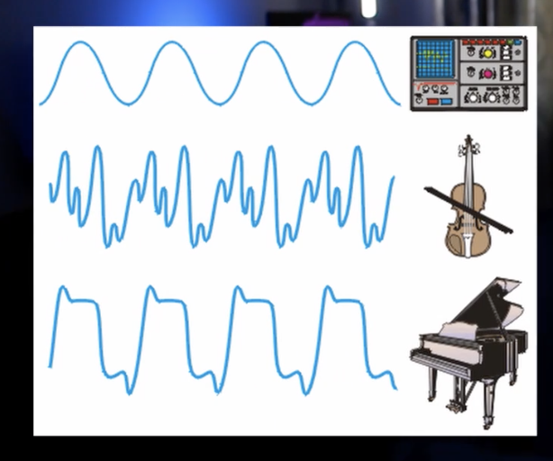
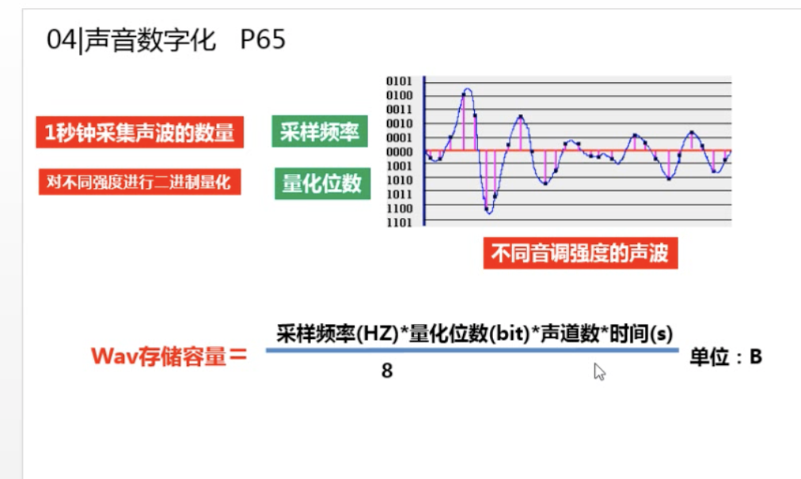
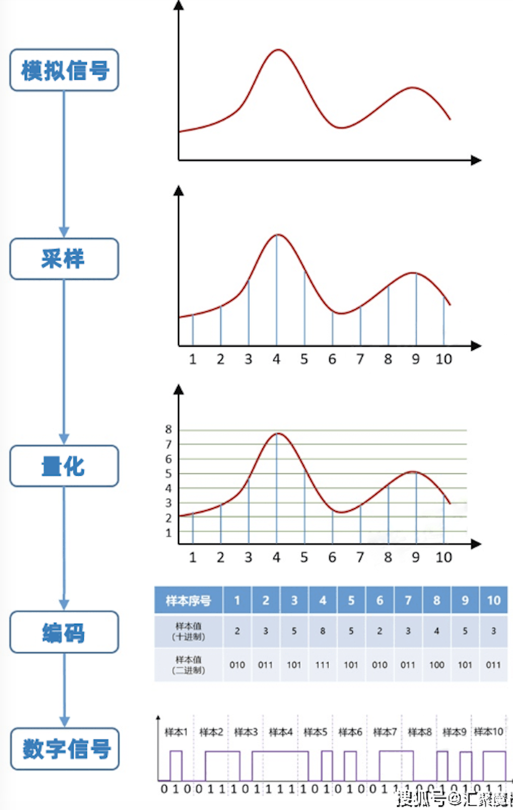

# 音频

## 相关概念

- 频率与音调
  
  - 通过频率可以区分声音的差别，对应人的感知就是音调。如男生、女生（女生频率更高）

- 振幅和响度
  
  - 振幅就是声音震动的幅度，也代表携带能量的大小，对应人的感知就是对应的响度或音量

- 波形、音色
  
  - 基波/谐波
    
    - 大多数音色都是通过波形叠加产生，如以下常见的波形：
      
      

- 均衡器
  
  - 定义
    - 在通信系统中是用来矫正波形信号中幅度频率特性和相位频率特性的部件
    - 在数字系统中作用是调整音频中各个频率范围的增益或衰减值
  - 理解
    - 调整沟构成该音频的不同频率声音的音量
  - 应用场景
    - 让声音更具特色，也可以修复瑕疵

- 降噪

- 压限
  
  - 压缩器和限制器的统称
    - 限制器：超过某一音量的声音直接切掉
    - 压缩器：压缩音频动态范围，对超过限制的声音做出增大或缩小

- 采样频率
  
  - 采样是指连续时间的离散化的过程，其中均匀采样是指每隔相等时间间隔采样一次，每秒需要采集的声音样本个数叫做采样频率，音频文件中常常见到的44.1kHz、11kHz就是指的采样（频）率。
  
  

## 相关链接

- [频率和音调](https://www.bilibili.com/video/BV1kf4y1b7Mf?spm_id_from=333.999.0.0&vd_source=08162de8dbdc17741ab9179cc9b5c1d1)
- https://www.bilibili.com/video/BV1yE411A7gy?spm_id_from=333.337.search-card.all.click&vd_source=384023524ae242f336b6c3d7cbaf0e7e